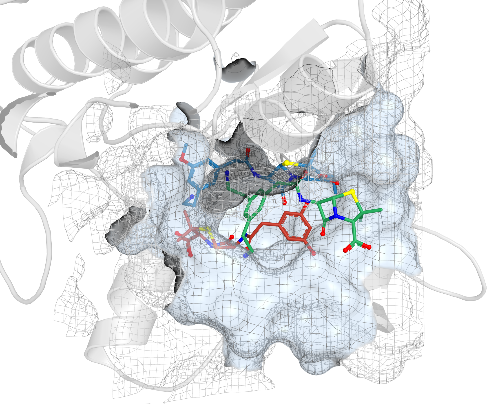
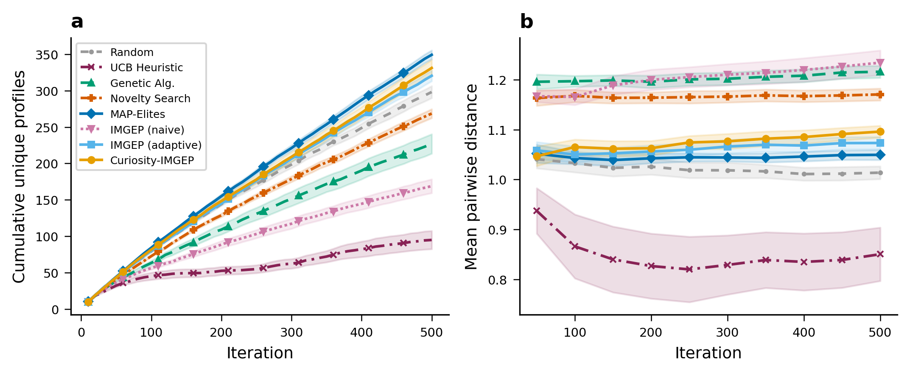

# Diversity-Seeking Exploration for Molecular Docking

[](LICENSE)
[](https://www.python.org/)
[](https://github.com/gnina/gnina)
[](https://github.com/flowersteam/adtool)
[]()
[]()

> **TL;DR** &nbsp; Treat docking as a *diversity-seeking* problem instead of an
> affinity-maximization one. **MAP-Elites** and **Curiosity-IMGEP** discover
> **+14%** more unique interaction profiles and **+21%** more unique
> Bemis&ndash;Murcko scaffolds than random search across **7 targets / 5 protein
> families**, at no cost to binding quality.

<p align="center">
  
</p>

<p align="center">
  <em>Three structurally distinct ligands discovered by Curiosity-IMGEP, all
  docking into the JAK3 ATP pocket (PDB&nbsp;3PJC) via distinct residue contact
  patterns &mdash; the kind of binding-mode diversity this work targets.</em>
</p>

---

## Why this exists

Virtual screening rewards a single number &mdash; binding affinity &mdash; and
converges on narrow chemical series exploring a single binding mode per pocket.
Yet a single pocket typically accommodates **multiple distinct binding modes**
with different hydrogen-bond networks, hydrophobic packing, and selectivity
implications. We show that off-the-shelf **quality-diversity** and
**curiosity-driven goal-exploration** algorithms, paired with a
**residue-level multi-interaction fingerprint**, systematically uncover this
diversity *in silico* under a fixed docking budget.

This repository contains everything needed to **reproduce every figure and
table in the paper from cached results**, and everything needed to
**re-run the docking campaign from scratch**.

## Headline results

| Method            | Unique profiles | vs. Random | Unique scaffolds | Best Vina (kcal/mol) |
|-------------------|:---------------:|:----------:|:----------------:|:--------------------:|
| Random            | 308 &plusmn; 29 | &mdash;    | 16.3 &plusmn; 3.2 | &minus;10.10        |
| Genetic Algorithm | 219 &plusmn; 60 | &minus;29% | &mdash;          | **&minus;11.22**    |
| Novelty Search    | 291 &plusmn; 37 | &minus;5%  | &mdash;          | &minus;10.52        |
| **Curiosity-IMGEP** | 331 &plusmn; 29 | **+7.5%** | **19.8 &plusmn; 5.8 (+21%)** | &minus;10.40 |
| **MAP-Elites**    | **350 &plusmn; 23** | **+14%** | 21.4 &plusmn; 8.1 | &minus;10.36   |

*Pooled across 7 targets &times; 10 seeds. Diversity-seeking methods retain
binding quality while uncovering interaction modes that an affinity-focused GA
misses by design.*

<p align="center">
  
</p>

## Quickstart &mdash; reproduce the figures (no docking needed)

The 560 per-run `results.json` files in `results/` are sufficient to
regenerate every figure and table in the paper.

```bash
git clone https://github.com/stef41/docking-diversity-exploration
cd docking-diversity-exploration
pip install rdkit numpy pandas matplotlib seaborn scipy

python code/analyze_v3.py          --results-dir results --out figures/
python code/chem_diversity_v3.py   --results-dir results --out figures/
python code/generate_docking_figures.py
```

## Re-run the docking campaign from scratch

> Wall-clock cost: ~800 GPU-hours on a single A100.

```bash
# 1. Install the exploration framework
git clone https://github.com/flowersteam/adtool
pip install -e adtool

# 2. Install GNINA (docking) and CReM (fragment-based mutation)
#    See https://github.com/gnina/gnina and https://github.com/DrrDom/crem

# 3. Launch all 560 runs (7 targets x 8 methods x 10 seeds)
bash code/run_all_v3.sh
```

## Repository layout

```
code/        Experiment runner (run_experiment_v3.py), analysis pipelines,
             chemical-diversity scripts, CNN-rescore validation, and
             figure-generation code.
configs/     JSON configurations for every (method, target, seed) run.
targets/     Prepared receptor PDB files + binding-box definitions for
             3V8D, 1ERE, 3EML, 1EVE, 4DFR, 3PJC, 4MNE (5 protein families).
results/     560 per-run results.json files containing SMILES, GNINA/Vina
             scores, residue-level interaction fingerprints, and full
             per-iteration trajectories.
figures/     Final PDF/PNG figures used in the manuscript + table1.tex.
paper/       Manuscript LaTeX source (jcim_submission.tex, jcim.bib).
```

## The seven targets

| PDB  | Protein        | Family           | Indication            | Pocket residues |
|------|----------------|------------------|-----------------------|:---------------:|
| 3V8D | CYP7A1         | Oxidoreductase   | Cholesterol metab.    | 95 |
| 1ERE | ER-&alpha;     | Nuclear receptor | Breast cancer         | 71 |
| 3EML | A<sub>2A</sub>R| GPCR             | Neurological          | 65 |
| 1EVE | AChE           | Hydrolase        | Alzheimer's           | 76 |
| 4DFR | DHFR           | Oxidoreductase   | Infection             | 55 |
| 3PJC | JAK3           | Kinase           | Immune disorders      | 60 |
| 4MNE | BRAF           | Kinase           | Melanoma              | 68 |

## The reachability ratio

A central practical contribution: goal-directed exploration only outperforms
random search when nearest-neighbor retrieval is **discriminative**. We define

$$R \;=\; \frac{\mathbb{E}_{g \sim P_\text{goal}}\,\min_{b \in \mathcal{B}} \lVert g - b \rVert_2}{\mathbb{E}_{b, b' \sim \mathcal{B}}\,\lVert b - b' \rVert_2}$$

Empirically, **R &raquo; 10** &rarr; goal-directed retrieval degenerates
toward random parent selection. Our residue-level fingerprint reduces *R* from
**~128** (atom-level baseline) to **~8**, which is when IMGEP variants begin
to beat random search.

## Software versions

| Tool   | Version  | Purpose                                                          |
|--------|----------|------------------------------------------------------------------|
| GNINA  | v1.0     | Molecular docking (Vina scoring, `--cnn_scoring none`, exh. 16)  |
| CReM   | v0.2.16  | Fragment-based mutation (5,955-entry fragment DB)                |
| RDKit  | latest   | Morgan / MACCS / Atom Pair fingerprints, Bemis&ndash;Murcko scaffolds |
| PLIP   | v2.2     | Protein&ndash;ligand interaction profiling                       |
| adtool | main     | Exploration framework (MAP-Elites, IMGEP, Curiosity-IMGEP)       |

## License

[MIT](LICENSE).

## Citation

```bibtex
@article{bugaud2026diversity,
  title   = {Diversity-Seeking Exploration Discovers Broader
             Docking-Predicted Interaction Profiles Across Protein Families},
  author  = {Bugaud, Z.},
  journal = {Journal of Chemical Information and Modeling},
  year    = {2026}
}
```
